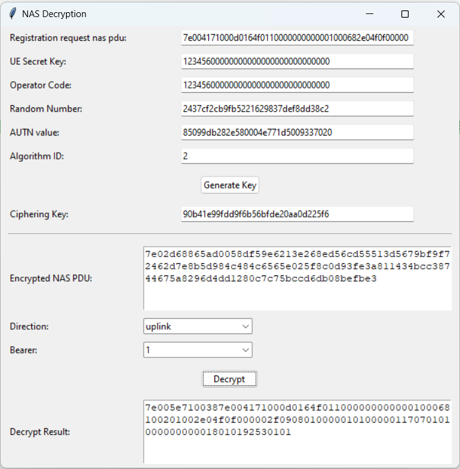

# 5GNasDecryption

This programe used to generate the NAS Ciphering Key from OP(operation code), UE secret key and other information obtain from f1ap messages. Using the generated ciphering key, this programe could decode the encrypted NAS PDU also.

How to use:

    git submodule init; git submodule update
    python ./decryptNas.py

This project has referred to https://github.com/jimtangshfx/5G_ciphered_NAS_decipher_tool, and using the Milenage module from project https://github.com/mitshell/CryptoMobile